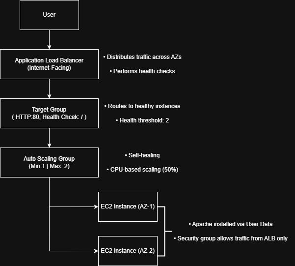
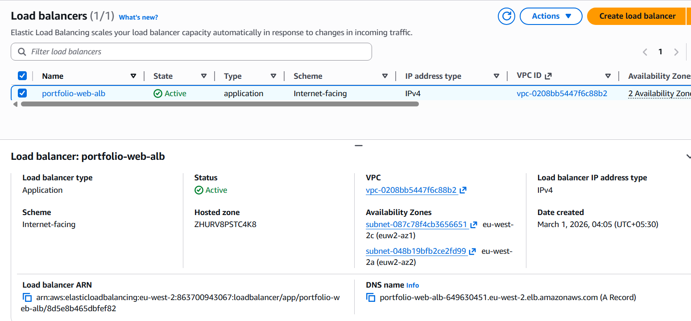
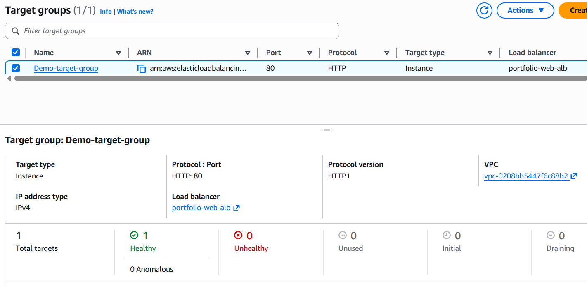
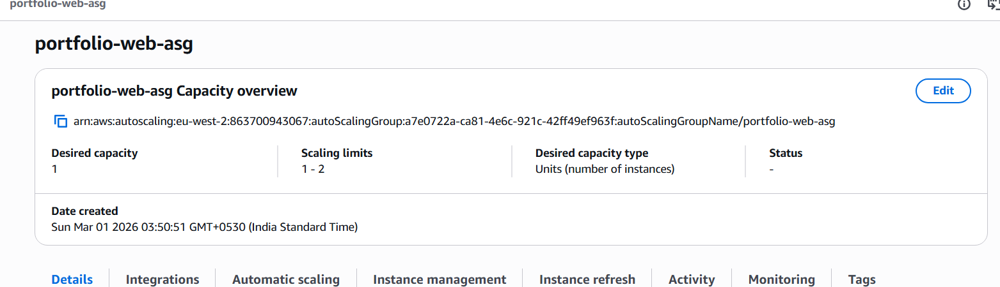
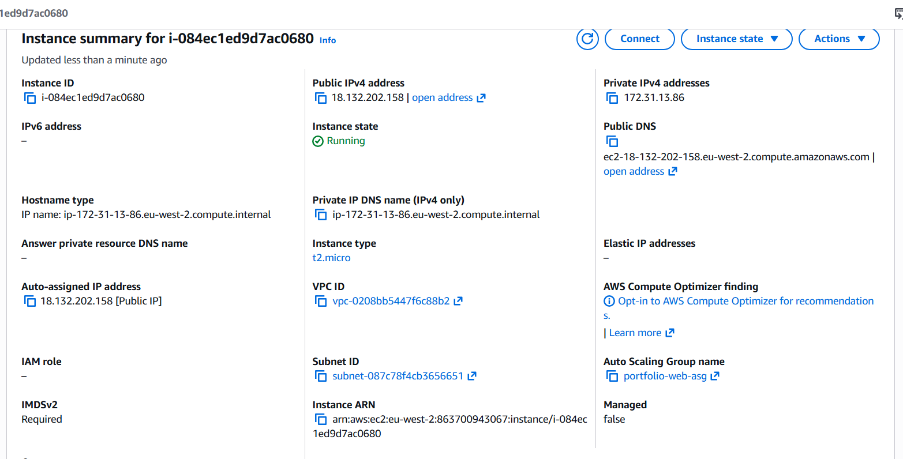

AWS High Availability Web Application
EC2 + Auto Scaling Group + Application Load Balancer

📌 Architecture Overview
This project demonstrates a highly available web application deployed across multiple Availability Zones in eu-west-2 using AWS core infrastructure services.
Traffic is distributed using an Internet-facing Application Load Balancer and EC2 instances scale automatically based on CPU utilization.

🏗 Architecture Flow
User → ALB → Target Group → Auto Scaling Group → EC2 (Multi-AZ)

🔹Key Features
Multi-AZ deployment (2 Availability Zones)
Target tracking scaling policy (50% CPU)
Health check threshold: 2
Self-healing architecture
Apache installed via EC2 User Data
Security group isolation (EC2 accessible only via ALB)

⚙️ Technical Configuration
Application Load Balancer
  Type: Application
  Scheme: Internet-facing
  IPv4
Target Group
  Protocol: HTTP
  Port: 80
  Health check path: /
  Healthy threshold: 2
Auto Scaling Group
  Min capacity: 1
  Max capacity: 2
  Desired capacity: 1
  Target tracking scaling (CPU 50%)
EC2 Instances
  Instance type: t2.micro
  Apache installed via User Data
  IMDSv2 required

📸 Screenshots

🧠 Architecture Design Principle
Stateless compute tier behind load balancer
Horizontal scaling across AZs
Designed for resilience and automatic recovery
  
